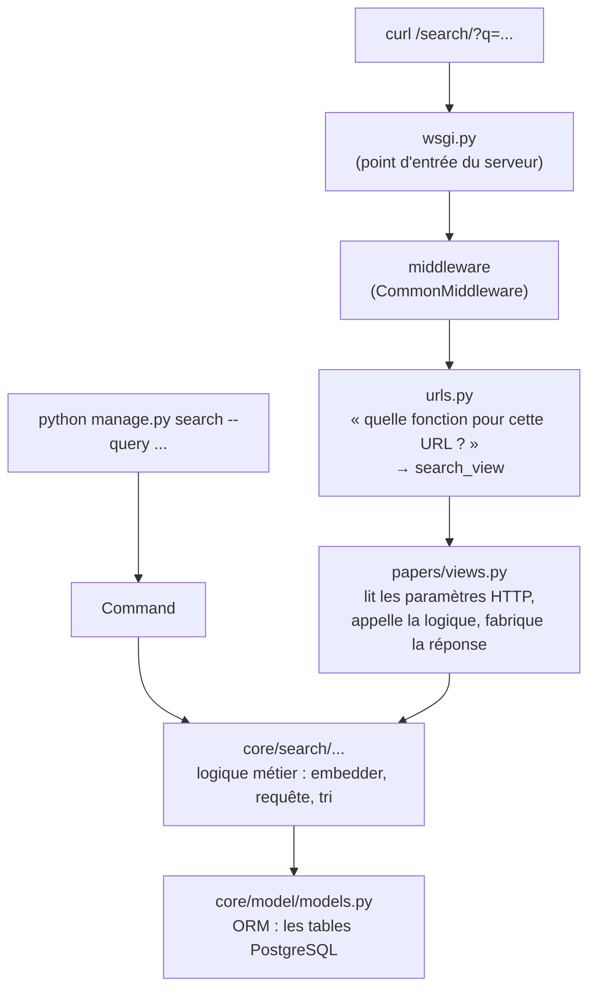

# Structure




## Middleware

Exemple :
```python
# paper_rag/common_middlewares.py

import time

def timing_middleware(get_response):
    def middleware(request):
        start = time.perf_counter()
        response = get_response(request)
        response["X-Duration"] = f"{time.perf_counter() - start:.3f}s"
        return response
    return middleware
```

```python
# paper_rag/settings.py
MIDDLEWARE = [
    "paper_rag.middleware.timing_middleware",
]
```
La fonction `timing_middleware` sera appelé pour chaque requête.


## URLS
- urls.py : associe un chemin à une fonction. Aucune logique.
    -> api blueprint de flask